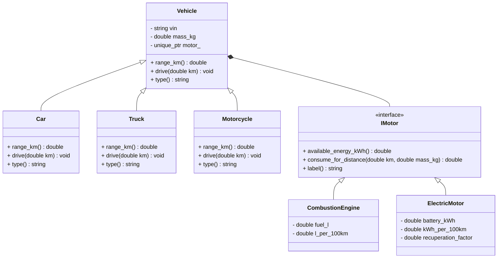

# Übung: Fahrzeuge, Vererbung & Aggregation

## Notwendige git Kommandos

```sh
git status
git branch -a
git switch main
# create a new local branch based on the origin main
git switch -c solution-020 origin/main
# perform changes
# ....
git add exercise-020
git commit -m "feat: add exercise number two"
# push the changes to the cloud
git push -u origin solution-020
....
```


## Lernziele

- Klassenhierarchie mit **abstrakten Basisklassen** und **überschriebenen** Methoden entwerfen.  
- **Vererbung** (is-a) sinnvoll einsetzen (z. B. `Car` ist ein `Vehicle`).  
- **Aggregation/Komposition** (has-a) für Teilsysteme nutzen (z. B. `Vehicle` hat einen `Motor`).  
- Späte Bindung via **virtual** / **override** verstehen.  
- Sauberer Umgang mit Ressourcen (z. B. `std::unique_ptr` für Besitzverhältnisse).  

## Fachlicher Kontext

Im Studiengang Fahrzeugelektronik betrachten wir ein Fahrzeug als System mit unterschiedlichen Antrieben.  
Die **Fahrzeugklasse** bildet die gemeinsamen Eigenschaften und das Verhalten ab, während **spezialisierte Fahrzeugtypen** Feinheiten überschreiben.  
Der **Motor/Antrieb** ist als austauschbares Modul (Aggregation/Komposition) modelliert — so lassen sich Verbrenner, E-Motor oder Hybrid kombinieren.

---

## Aufgabenbeschreibung

### 1) Klassen- & Schnittstellendesign

#### Fahrzeuge (Vererbung)

- `class Vehicle` (abstrakt)
- Spezialisierungen: `Car`, `Truck`, `Motorcycle`

####  Antriebe (Aggregation/Komposition)

- `class IMotor` (abstrakt)
- Implementierungen: `CombustionEngine`, `ElectricMotor`, optional `HybridMotor`

#### Aggregation/Komposition

- `Vehicle` besitzt genau einen `std::unique_ptr<IMotor> motor_`.

---

## UML-Klassendiagramm



---

## Abgabe

- `motor.hpp`, `vehicle.hpp`, `main.cpp`  
- Ergänzen Sie mindestens einen weiteren Fahrzeugtyp (z. B. `Motorcycle`) **oder** einen weiteren Motortyp (z. B. `HybridMotor`).  

---

Viel Erfolg 🚗⚡️🚚