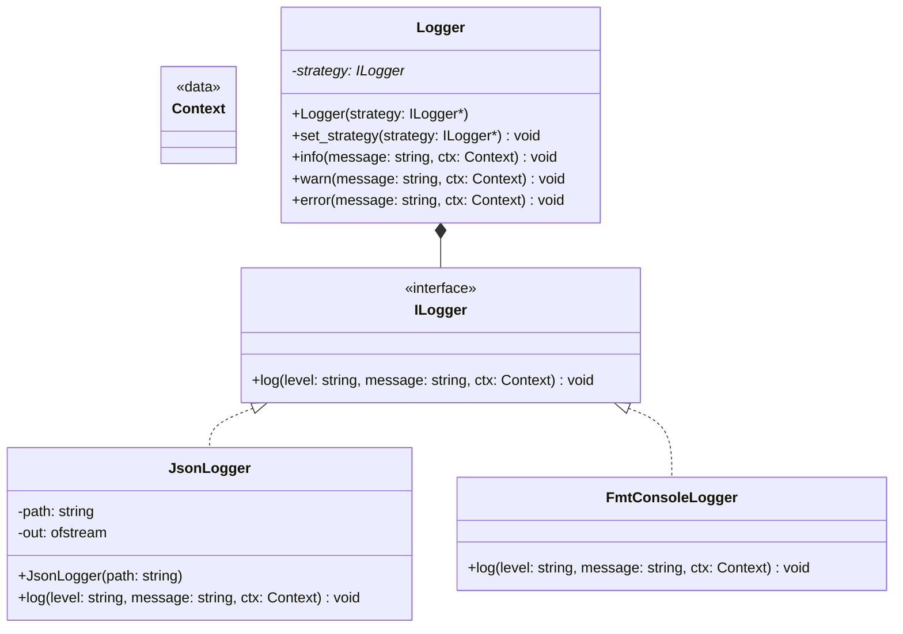

# Übung: Strategy Pattern – Logger mit JSON- und fmt-Ausgabe

## Notwendige git Kommandos

```sh
git status
git branch -a
git switch main
# create a new local branch based on the origin main
git switch -c solution-030 origin/main
# perform changes
# ....
git add exercise-030
git commit -m "feat: add exercise number two"
# push the changes to the cloud
git push -u origin solution-030
....
```

## Lernziele

- **Strategy Pattern** verstehen und anwenden (Austausch von Algorithmen zur Laufzeit).
- **Interface-basierte Programmierung** und **Dependency Injection** nutzen.
- Saubere **Trennung von Anliegen** (Kontext vs. konkrete Strategie).

---

## Anforderungen (Kurz)

- `ILogger` Interface mit `log(level, message, ctx)`
- Strategien: `JsonLogger` (NDJSON in Datei) und `FmtConsoleLogger` (fmt auf STDOUT)
- `Logger`-Kontext mit `info/warn/error` und `set_strategy(...)`

---

## UML (Mermaid, GitHub-kompatibel)

> Hinweis: GitHub-Mermaid unterstützt keine C++-Templates oder Default-Parameter in Signaturen.
> Deshalb werden Typen vereinfacht dargestellt. Verwenden Sie für `Context` z. B. `std::map<std::string,std::string>`.



---

## Skeleton (unverändert verwendbar)

### `ilogger.hpp`

```cpp
#pragma once
#include <string>
#include <map>

using Context = std::map<std::string, std::string>;

struct ILogger {
    virtual ~ILogger() = default;
    virtual void log(const std::string& level,
                     const std::string& message,
                     const Context& context = {}) = 0;
};
```

### `json_logger.hpp` / `json_logger.cpp`

```cpp
// json_logger.hpp
#pragma once
#include "ilogger.hpp"
#include <fstream>
#include <string>

class JsonLogger : public ILogger {
public:
    explicit JsonLogger(std::string path);
    ~JsonLogger() override;
    void log(const std::string& level,
             const std::string& message,
             const Context& context = {}) override;
};
```

```cpp
// json_logger.cpp
#include "json_logger.hpp"
#include "nlohmann/json.hpp"
#include <chrono>
#include <iomanip>
#include <sstream>

using json = nlohmann::json;


JsonLogger::JsonLogger(std::string path) : out_(std::move(path), std::ios::app) {}
JsonLogger::~JsonLogger() = default;

void JsonLogger::log(const std::string& level,
                     const std::string& message,
                     const Context& context) {
    //....
}
```

### `fmt_console_logger.hpp` / `fmt_console_logger.cpp`

```cpp
// fmt_console_logger.hpp
#pragma once
#include "ilogger.hpp"

class FmtConsoleLogger : public ILogger {
public:
    void log(const std::string& level,
             const std::string& message,
             const Context& context = {}) override;
};
```

```cpp
// fmt_console_logger.cpp
#include "fmt_console_logger.hpp"
#include <fmt/core.h>
#include <chrono>
#include <iomanip>
#include <sstream>


void FmtConsoleLogger::log(const std::string& level,
                           const std::string& message,
                           const Context& context) {
    // ...
}
```

### `logger.hpp`

```cpp
#pragma once
#include "ilogger.hpp"
#include <memory>
#include <utility>

class Logger {
public:
    explicit Logger(std::unique_ptr<ILogger> strat) : strategy_(std::move(strat)) {}
    void set_strategy(std::unique_ptr<ILogger> strat) { strategy_ = std::move(strat); }

    void info(const std::string& msg, const Context& ctx = {}) {
        if (strategy_) strategy_->log("info", msg, ctx);
    }
    void warn(const std::string& msg, const Context& ctx = {}) {
        if (strategy_) strategy_->log("warn", msg, ctx);
    }
    void error(const std::string& msg, const Context& ctx = {}) {
        if (strategy_) strategy_->log("error", msg, ctx);
    }
private:
    std::unique_ptr<ILogger> strategy_;
};
```

---

## Abnahmekriterien

- Austausch der Log-Strategie **zur Laufzeit** ohne Codeänderung im Anwendungskern (`Logger` nutzt nur `ILogger`).
- Korrekte Ausgabeformate (JSON pro Zeile; fmt-Ausgabe auf STDOUT).
- Ressourcen- und Ausnahme-sicherer Datei-Umgang im `JsonLogger`.
- Sinnvolle Timestamps & Levels.
- Kleine **README.md** mit Build-Hinweisen, `app.log.jsonl` als Beispielausgabe.

---

## Bonus-Ideen

- **Konfiguration via JSON** (z. B. `{"logger":"json","path":"app.log.jsonl"}`) statt festem Wechsel in `main`.
- **Asynchrones Logging**: Queue + Worker-Thread (Achtung: Thread-Sicherheit, Flush).
- **Rotating File Logger** (Max-Größe in MB, Keep-Count).
- **Context-Adapter**: automatische Felder (Hostname, PID, Thread-ID).

Viel Spaß beim Strategien‑Tauschen! 🧩
