# Übung: Strategy Pattern – Logger mit JSON- und fmt-Ausgabe

## Lernziele
- **Strategy Pattern** verstehen und anwenden (Austausch von Algorithmen zur Laufzeit).
- **Interface-basierte Programmierung** und **Dependency Injection** nutzen.
- Saubere **Trennung von Anliegen** (Kontext vs. konkrete Strategie).

> Annahmen: *nlohmann::json* und *fmt* stehen im Projekt bereit.

---

## Anforderungen (Kurz)
- `ILogger` Interface mit `log(level, message, ctx)`
- Strategien: `JsonLogger` (NDJSON in Datei) und `FmtConsoleLogger` (fmt auf STDOUT)
- `Logger`-Kontext mit `info/warn/error` und `set_strategy(...)`

---

## UML (Mermaid, GitHub-kompatibel)

> Hinweis: GitHub-Mermaid unterstützt keine C++-Templates oder Default-Parameter in Signaturen.

```mermaid
classDiagram
    class Context {
        <<data>>
        %% Schlüssel-Werte-Paare (z.B. module=auth, user=alice)
    }

    class ILogger {
        <<interface>>
        +log(level: string, message: string, ctx: Context) void
    }

    class JsonLogger {
        -path: string
        -out: ofstream
        +JsonLogger(path: string)
        +log(level: string, message: string, ctx: Context) void
    }

    class FmtConsoleLogger {
        +log(level: string, message: string, ctx: Context) void
    }

    class Logger {
        -strategy: ILogger*
        +Logger(strategy: ILogger*)
        +set_strategy(strategy: ILogger*) void
        +info(message: string, ctx: Context) void
        +warn(message: string, ctx: Context) void
        +error(message: string, ctx: Context) void
    }

    ILogger <|.. JsonLogger
    ILogger <|.. FmtConsoleLogger
    Logger *-- ILogger
```

> Deshalb werden Typen vereinfacht dargestellt. Verwenden Sie für `Context` z. B. `std::map<std::string,std::string>`.



---

## Skeleton (unverändert verwendbar)

### `ilogger.hpp`
```cpp
#pragma once
#include <string>
#include <map>

using Context = std::map<std::string, std::string>;

struct ILogger {
    virtual ~ILogger() = default;
    virtual void log(const std::string& level,
                     const std::string& message,
                     const Context& context = {}) = 0;
};
```

### `json_logger.hpp` / `json_logger.cpp`
```cpp
// json_logger.hpp
#pragma once
#include "ilogger.hpp"
#include <fstream>
#include <string>

class JsonLogger : public ILogger {
public:
    explicit JsonLogger(std::string path);
    ~JsonLogger() override;
    void log(const std::string& level,
             const std::string& message,
             const Context& context = {}) override;
private:
    std::ofstream out_;
};
```

```cpp
// json_logger.cpp
#include "json_logger.hpp"
#include "nlohmann/json.hpp"
#include <chrono>
#include <iomanip>
#include <sstream>

using json = nlohmann::json;

static std::string iso8601_now_utc() {
    using namespace std::chrono;
    auto now = system_clock::now();
    std::time_t t = system_clock::to_time_t(now);
    std::tm tm{};
#ifdef _WIN32
    gmtime_s(&tm, &t);
#else
    gmtime_r(&t, &t);
#endif
    std::ostringstream oss;
    oss << std::put_time(&tm, "%FT%TZ");
    return oss.str();
}

JsonLogger::JsonLogger(std::string path) : out_(std::move(path), std::ios::app) {}
JsonLogger::~JsonLogger() = default;

void JsonLogger::log(const std::string& level,
                     const std::string& message,
                     const Context& context) {
    json j{
        {"timestamp", iso8601_now_utc()},
        {"level", level},
        {"message", message}
    };
    if (!context.empty()) j["context"] = context;
    out_ << j.dump() << '\n';
    out_.flush();
}
```

### `fmt_console_logger.hpp` / `fmt_console_logger.cpp`
```cpp
// fmt_console_logger.hpp
#pragma once
#include "ilogger.hpp"

class FmtConsoleLogger : public ILogger {
public:
    void log(const std::string& level,
             const std::string& message,
             const Context& context = {}) override;
};
```

```cpp
// fmt_console_logger.cpp
#include "fmt_console_logger.hpp"
#include <fmt/core.h>
#include <chrono>
#include <iomanip>
#include <sstream>

static std::string iso8601_now_local() {
    using namespace std::chrono;
    auto now = system_clock::now();
    std::time_t t = system_clock::to_time_t(now);
    std::tm tm{};
#ifdef _WIN32
    localtime_s(&tm, &t);
#else
    localtime_r(&t, &tm);
#endif
    std::ostringstream oss;
    oss << std::put_time(&tm, "%FT%T");
    return oss.str();
}

void FmtConsoleLogger::log(const std::string& level,
                           const std::string& message,
                           const Context& context) {
    std::string ctx_str;
    for (const auto& kv : context) {
        if (!ctx_str.empty()) ctx_str += ' ';
        ctx_str += kv.first + '=' + kv.second;
    }
    if (!ctx_str.empty()) ctx_str = " " + ctx_str;

    fmt::print("[{}] ({}){} :: {}\n", iso8601_now_local(), level, ctx_str, message);
}
```

### `logger.hpp`
```cpp
#pragma once
#include "ilogger.hpp"
#include <memory>
#include <utility>

class Logger {
public:
    explicit Logger(std::unique_ptr<ILogger> strat) : strategy_(std::move(strat)) {}
    void set_strategy(std::unique_ptr<ILogger> strat) { strategy_ = std::move(strat); }

    void info(const std::string& msg, const Context& ctx = {}) {
        if (strategy_) strategy_->log("info", msg, ctx);
    }
    void warn(const std::string& msg, const Context& ctx = {}) {
        if (strategy_) strategy_->log("warn", msg, ctx);
    }
    void error(const std::string& msg, const Context& ctx = {}) {
        if (strategy_) strategy_->log("error", msg, ctx);
    }
private:
    std::unique_ptr<ILogger> strategy_;
};
```

---

